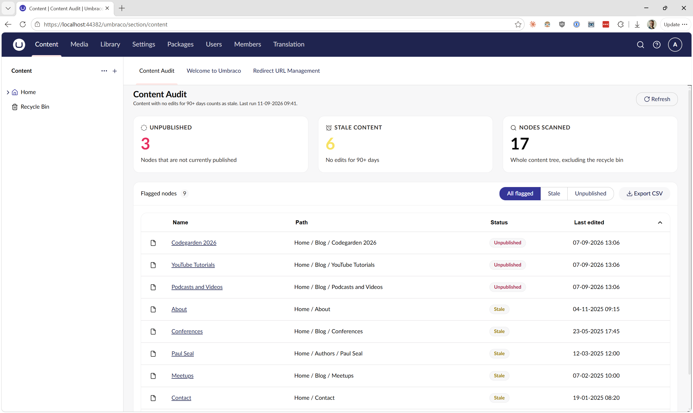
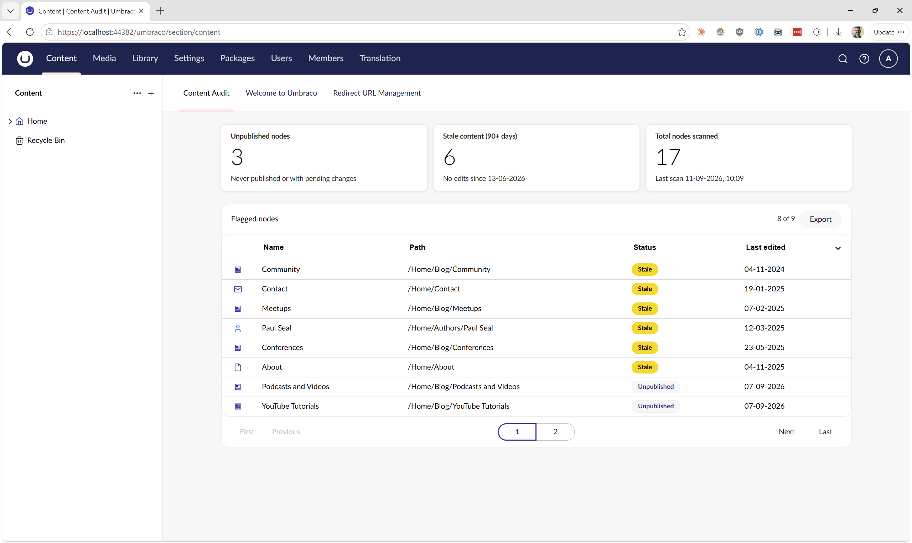
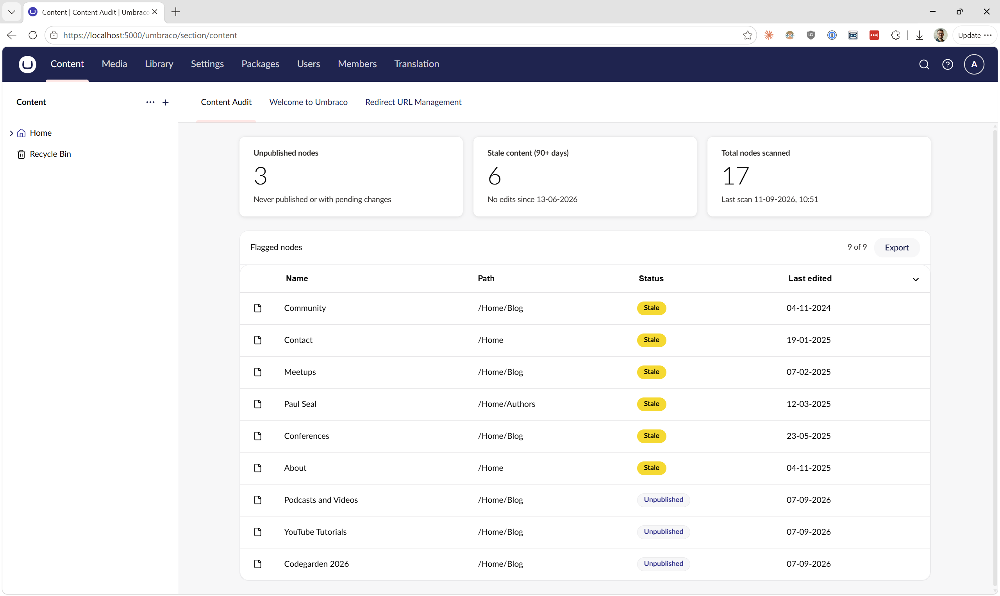
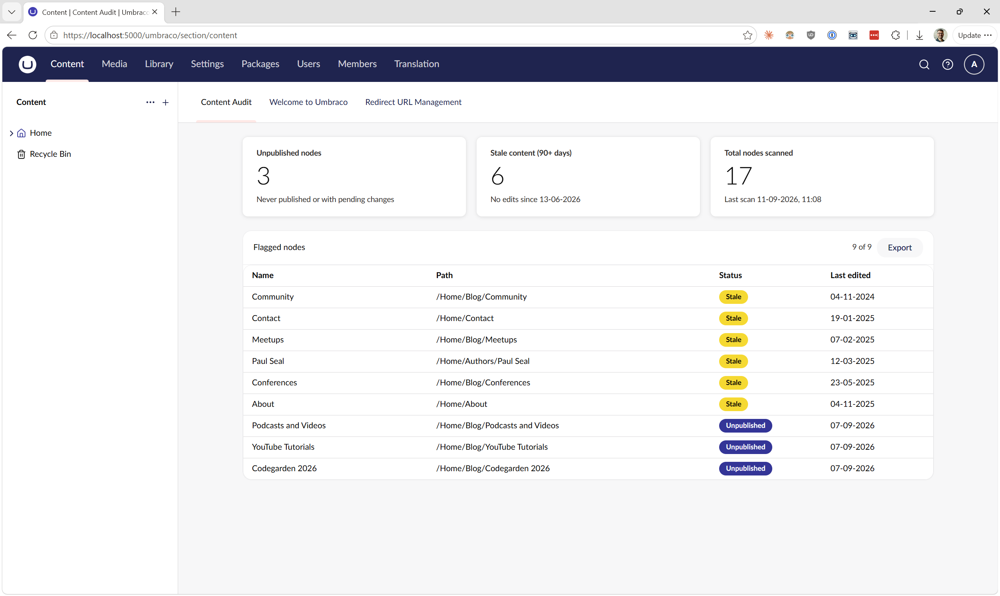
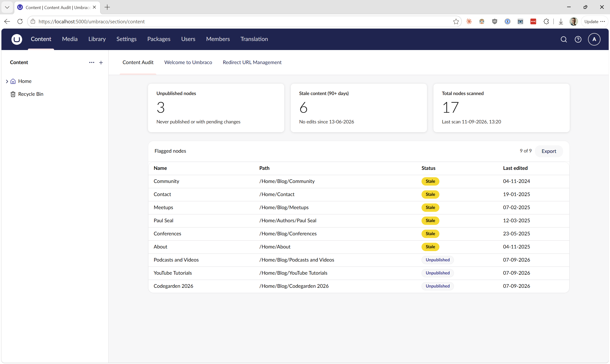

# Agentic Developer Workshop: Content Audit

Each folder gives the agent more to work with along; prompt, context, harness, loop. The output gets better each time. The cost and time taken changes each time.

Run the sections in order. Each one hands something to the next.

| Section | Folder | What the agent gets |
| --- | --- | --- |
| 1. Prompt only | `section-1-prompt-only` | The prompt. Nothing else |
| 2. With context | `section-2-with-context` | Plus the design files. Plus the CMS source if you want |
| 3. With harness | `section-3-with-harness` | Plus notes, a plan, and the Umbraco skills |
| 4. With loop | `section-4-with-loop` | Plus your own skills, and a goal it works at until it is done |

## The prompt

This is the prompt for the first three sections:

```
Create an Umbraco 'Content Audit' dashboard that users see when first logging in, showing information about:
- the number of unpublished nodes
- stale content (not been touched in 90+ days)
- number of nodes scanned

Also include a table of 'Flagged nodes' with the node's path in the content tree, a status of 'stale' or 'unpublished', and the last edited date. The table should have pagination and an export feature.
```

## Run times from a test pass

One run of each. Yours will differ.

| Section | Time | Tokens | Notes |
| --- | --- | --- | --- |
| 1. Prompt only | ~26 min | ~208k | |
| 2. With context | ~17 min | ~187k | |
| 2. With context + CMS source | ~18 min | ~184k | It chose to run Playwright too |
| 3. With harness | ~12 min | ~140k | With notes in place |
| 4. With loop, no `/goal` | ~15 min | ~170k | |
| 4. With loop and `/goal` | ~24 min | ~535k | |

---

## Section 1: Prompt only

**The point:** see what a bare prompt gets you.

**Run:** open Claude in `section-1-prompt-only`. Paste the prompt.

**Carry forward:** nothing. This is the baseline.

### Example outcome



Each version created will be slightly different.  
Upload a screenshot to the #agentic-developer-workshop so that we can all can see how the outcome changes on each run.

---

## Section 2: With context

**The point:** give the agent a design to follow. Otherwise it makes one up.

**What is new:** a pre built Claude Design output sits in the `design-assets` folder at the repo root.  
The section's `.claude/settings.json` add this folder to Claude's context. It still has to go and look. Say so in the prompt if it does not.

**Run:** open Claude in `section-2-with-context`. Paste the same prompt.

You can optionally point it at the Umbraco CMS source first. Use `/add-dir /path/to/umbraco`.

**Then:** when it finishes, make the two documents that Sections 3 and 4 need.

```
/init
```

This creates a `CLAUDE.md` file. These are notes about the project that the agent reads every time.

```
Create a PRD using the prd-writer skill as a document in the /docs folder. 
Create this based on what has been implemented so far in this run through.
```

The second makes a PRD (product requirements document). That is a plan of what has been (and will be) built.

**Carry forward:** check both documents are correct. Then copy them into Sections 3 and 4.

- `CLAUDE.md` goes in the top of `section-3-with-harness` and `section-4-with-loop`
- the PRD goes in a `docs` folder inside each of those. The Section 4 prompt looks there

### Example outcome




---

## Section 3: With harness

**The point:** teach the agent about Umbraco itself. Then it stops guessing.

**What is new:** the Claude.md and PRD you copied in from Section 2. 
Plus the Umbraco skills. Those are short how-to files and documentation the agent can use when it needs to understand the latest best practice.

Install the skills first:

```bash
# Add the Umbraco CMS Backoffice Skills marketplace
/plugin marketplace add umbraco/Umbraco-CMS-Backoffice-Skills

# Install backoffice extension skills (58 skills)
/plugin install umbraco-cms-backoffice-skills@umbraco-backoffice-marketplace

# Install testing skills (8 skills). Optional, but worth it
/plugin install umbraco-cms-backoffice-testing-skills@umbraco-backoffice-marketplace
```

**Run:** open Claude in `section-3-with-harness`. Paste the same prompt again, and let it
finish the whole build — don't move on to the next step until the dashboard is actually
done.

**Then, once the build has finished (not before):** run the retro.

```
/harness-retro
```

It's installed at `section-3-with-harness/.claude/skills/harness-retro` — it mines what just
happened for friction and drafts a lean skill from it, rather than a one-shot guess at "what
did I learn." Running it mid-build gives it an unfinished task to retro on, so wait for the
build to actually be done first.

**Carry forward:** check the new skill(s) are right and fix them. Then copy them — and
`harness-retro` itself — into `section-4-with-loop/.claude/skills`, so the next stage can
keep running its own retros too.

### Example outcome



---

## Section 4: With loop

**The point:** everything from the first three sections. Plus a goal. The agent keeps working until the plan is met.

**What is new:** your own skills from Section 3. The `docs` folder from Section 2. And `/goal`.

**Run:** open Claude in `section-4-with-loop`. Use this prompt.

```
/goal Create an Umbraco 'Content Audit' dashboard that users see when first logging in, showing information about:
- the number of unpublished nodes
- stale content (not been touched in 90+ days)
- number of nodes scanned

Also include a table of 'Flagged nodes' with the node's path in the content tree, a status of 'stale' or 'unpublished', and the last edited date. The table should have pagination and an export feature.

Use the `docs` folder files to help guide the implementation and ensure all requirements are met.

Run until you've satisfied the PRD requirements.
```

### Example outcome



---

## Repo layout

```
assets/               Screenshots used in this README
design-assets/        The design the agent reads from Section 2 on
ContentAudit/         Starting copy of the add-on, with a small example dashboard
ContentAuditWorkshop/ Starting copy of the Umbraco site
section-1-prompt-only/
section-2-with-context/
section-3-with-harness/
section-4-with-loop/
```

The four section folders are copies of those two. The copies leave out the example dashboard. So every run starts from an empty add-on.
